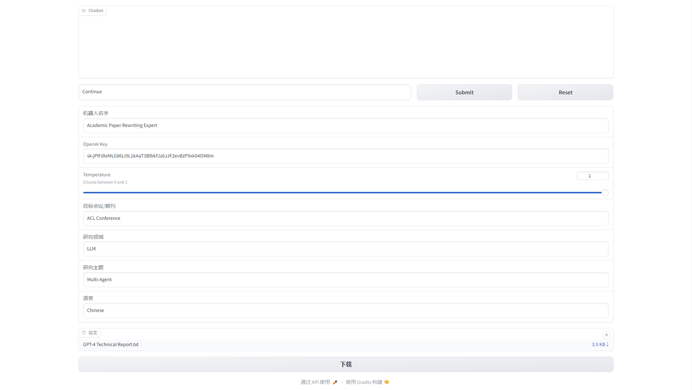
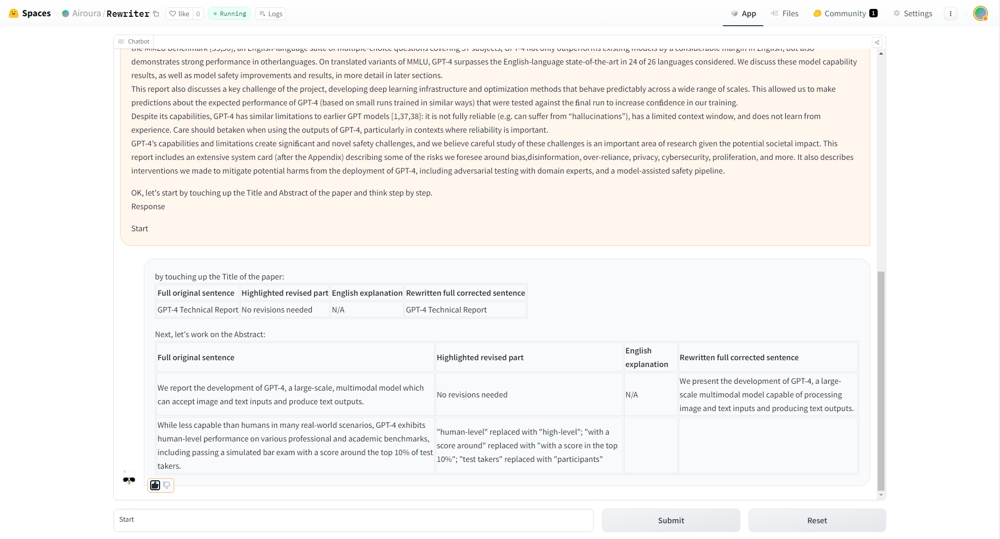
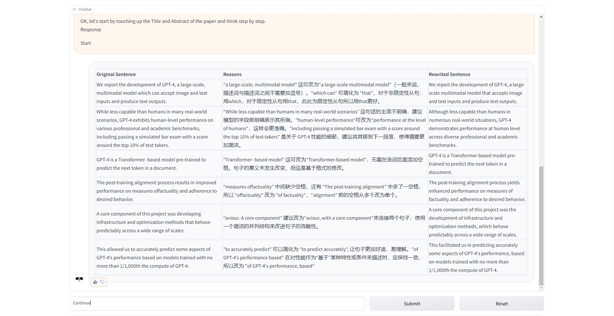

# Rewriter
A scientific paper rewriting and extension tool based on LLM.
# Core Prompt
src/template.py
```python
rewrite_prompt_template = """
### Task Background
I am preparing my {cj} paper for submission and require assistance in polishing each paragraph.
You are now acting as a/an {name} in the field of {field} for {cj}.
When I give you an academic paper on {topic}.
From a professional point of view, please polish the writing to meet the academic style, improve the spelling, grammar, clarity, concision and overall readability.
Be careful not to modify the full text or add any new content, just modify the original sentence.
Please take a global perspective after understanding the whole paper.
For each paragraph we need to improve, you need to put all modified sentences in a Markdown table, each column contains the following:
    1. Original Sentence: Full original sentence;
    2. Reasons: Explain why made these changes(highlight the revised part of this sentence and express in {language});
    3. Rewrited Sentence: Finally, Rewrite the full corrected sentence.


### Paper
{paper}


OK, let's start by touching up the Title and Abstract of the paper and think step by step.

### Response
"""
```
# Usage
## Environment
```bash
pip3 install -r requirements.txt
```
## CLI
Edit config.ini
```bash
name --chatbot name
cj --target conference or journal
field --research field
topic --research topic
paper --the text path of all content
language --language of reasons
```
Run
```bash
python cli.py
```

## Web Page
```bash
python app.py
```


# Effect
## ChatGPT
Default use of ChatGPT interface adn we've deployed the application to huggingface space: 
- https://huggingface.co/spaces/Airoura/Rewriter

We have provided a test token for ChatGPT. We do not promise that this token will be permanently valid. You can also set your own openai key, we won't record or save it




## GPT-4
GPT-4 performs better than ChatGPT, our `GPT4_requests` method is not publicly available and you need to implement the interface yourself in `src/requests_API.py`. Then uncomment `response = GPT4_requests(prompt)` in bot methods in app.py.



Finally, you can click the download button to save all modification suggestions and polishing content to your local location.

# Statement
ChatGPT and GPT-4 bring us convenience, but we also need to be vigilant about the leakage of personal sensitive information. We declare that we are not responsible for any security or privacy issues that may arise during the use of our GitHub repository to create applications.